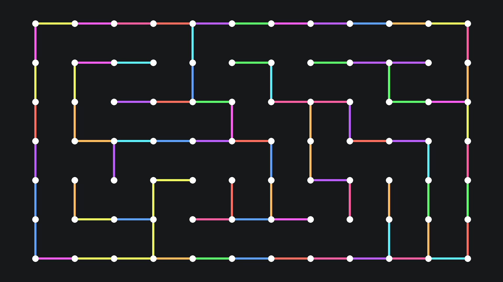

# Wallpaper Generator

<table align="center">
    <tr>
        <td>
            
        </td>
        <td>
            
    </tr>
    <tr>
        <td>
            
        <td>
            
    </tr>
</table>

## 🚀 Usage
1. Create a virtual environment with your preferred method and activate it
1. Install the requirements with `pip install -r requirements.txt`
1. Generate an image with
    ```bash
    manim -s src/<script>.py -o <filename>
    ```
    The rendered image will appear in `outputs/<filename>`
1. Alternatively, generate all wallpapers at once with
    ```bash
    for pth in $(find src/ -maxdepth 1 -type f -name "*.py"); do manim -s $pth -o $(basename $pth .py); done
    ```


## ⚙️ Configuration
Modify [options.json](options.json) to fit your needs.

The fields are as follows:
- `dimensions.width`: the width of your wallpapers in pixels
- `dimensions.height`: the height of your wallpapers in pixels
- `colors.background`: hex colour code string for the background of the image
- `colors.foreground`: hex colour code string for the foreground elements such as dots
- `colors.palette`: array of hex color code strings for the other elements

```json
{
    "dimensions": {
        "width": 1920,
        "height": 1080
    },
    "colors": {
        "background": "#16181a",
        "foreground": "#ffffff",
        "palette": [
            "#5ea1ff",
            "#5eff6c",
            "#5ef1ff",
            "#ff6e5e",
            "#f1ff5e",
            "#ff5ef1",
            "#ff5ea0",
            "#ffbd5e",
            "#bd5eff"
        ]
    }
}
```

## 🤝 Acknowledgements
- [scottmckendry/cyberdream.nvim](https://github.com/scottmckendry/cyberdream.nvim): Colorscheme used in the example wallpapers and config.
- [ManimCommunity/manim](https://github.com/ManimCommunity/manim): Python library used for generating wallpapers

