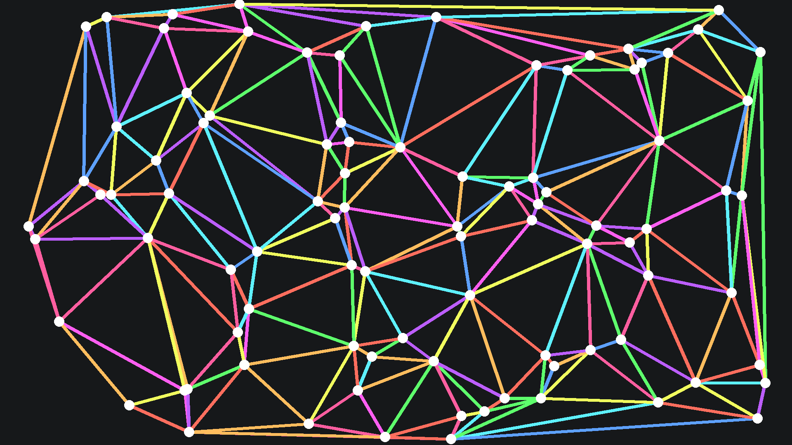
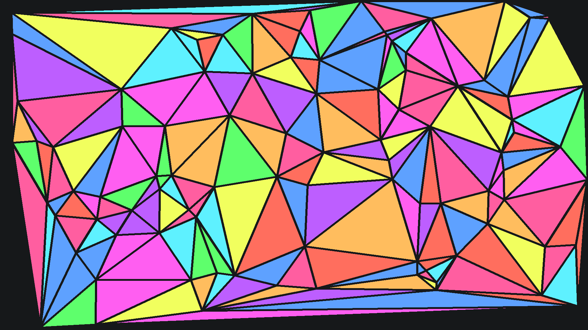

# Wallpaper Generator

<table align="center">
    <tr>
        <td>
            
        </td>
        <td>
            
    </tr>
    <tr>
        <td>
            
        <td>
            
    </tr>
    <tr>
        <td>
            
        <td>
            
    </tr>
</table>

## 🚀 Usage
1. Create a virtual environment with your preferred method, and activate it
1. Install the requirements with `pip install -r requirements.txt`
1. Generate an image with
    ```bash
    python src/<script>.py --config <configpath> -output <output>
    ```
    The config path defaults to `config.json` if not supplied. An output is required.
1. Alternatively, generate all wallpapers at once with
    ```bash
    for pth in $(find src/ -maxdepth 1 -type f -name "*.py"); do python $pth -o output/$(basename $pth .py).png; done
    ```
    They will appear in `output/<script_basename>.png`


## ⚙️ Configuration
Modify [options.json](options.json) to fit your needs, or create a new json file and pass it in with the `--config` argument.

The fields are as follows:
- `dimensions.width`: the width of your wallpapers in pixels
- `dimensions.height`: the height of your wallpapers in pixels
- `dimensions.scale`: the scale factor for your wallpapers, affecting things such as line thickness and dot size
- `colors.background`: hex color code string for the background of the image
- `colors.foreground`: hex color code string for the foreground elements such as dots
- `colors.palette`: array of hex color code strings for the other elements

```json
{
    "dimensions": {
        "width": 1920,
        "height": 1080,
        "scale": 1
    },
    "colors": {
        "background": "#16181a",
        "foreground": "#ffffff",
        "palette": [
            "#5ea1ff",
            "#5eff6c",
            "#5ef1ff",
            "#ff6e5e",
            "#f1ff5e",
            "#ff5ef1",
            "#ff5ea0",
            "#ffbd5e",
            "#bd5eff"
        ]
    }
}
```

## 🤝 Acknowledgements
- [scottmckendry/cyberdream.nvim](https://github.com/scottmckendry/cyberdream.nvim): Colorscheme used in the example wallpapers and config

